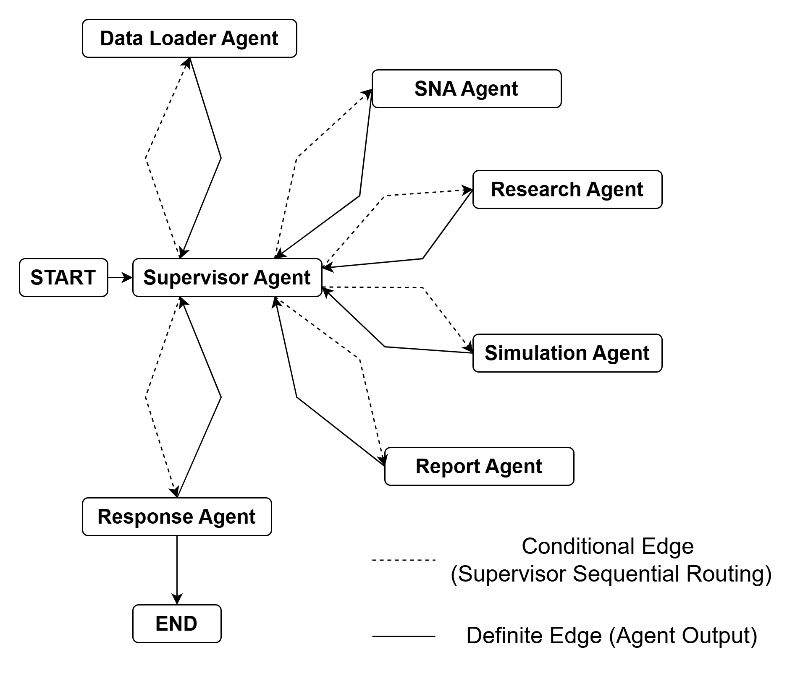

# 🐄 CowNet-AI: Multi-Agent Framework for Dairy Herd Social Network Analysis

<p align="center">
  <strong>Translating Social Network Analytics into Explainable Dairy Management Decisions</strong>
</p>

<p align="center">
  <em>Part of the MooAnalytica Digital Livestock AI Suite</em>
</p>

<p align="center">
  <a href="#-quick-start">Quick Start</a> •
  <a href="#-features">Features</a> •
  <a href="#-architecture">Architecture</a> •
  <a href="#-api">API</a> •
  <a href="#-contributing">Contributing</a>
</p>

---

## 📖 Overview

**CowNet-AI** is an open-source, modular, multi-agent framework developed by the [MooAnalytica Research Group](https://mooanalytica.org) at Dalhousie University. It integrates **Social Network Analysis (SNA)**, **AI-driven behavioral modeling**, and **explainable decision support** to transform raw sensor data (UWB tracking, accelerometers, video) into actionable insights for precision dairy management.

The system uses a **LangGraph-based multi-agent architecture** with specialized agents for data loading, network analysis, simulation, research synthesis, and farmer-friendly reporting—all orchestrated by an intelligent supervisor agent.

---

## ✨ Features

| Feature | Description |
|---------|-------------|
| **🔗 Social Network Analysis** | Computes herd metrics (centrality, modularity, density, risk scores) from UWB interaction data |
| **🤖 Multi-Agent Architecture** | Specialized agents for data, SNA, simulation, research, and reporting |
| **📊 What-If Simulations** | Predict herd dynamics after network changes (e.g., cow removal) |
| **🔬 Research Integration** | Evidence-based recommendations via Semantic Scholar integration |
| **📄 PDF Reports** | Farmer-friendly briefings with actionable recommendations |
| **🧠 Long-Term Memory** | mem0 + pgvector for contextual responses across sessions |
| **💾 Conversation Persistence** | PostgreSQL checkpointing for multi-turn conversations |
| **🌐 REST API** | FastAPI backend for web/mobile integration |

### Risk Scores Computed

- **Conflict Risk** — Interaction frequency and proximity patterns
- **Isolation Risk** — Network centrality and herd distance metrics
- **Bridge Score** — Cows connecting separate social communities

---

## 🏗️ Architecture



| Agent | Responsibility |
|-------|----------------|
| **Supervisor** | Routes queries, manages workflow state |
| **Data Loader** | Loads interaction data from CSV/sensors |
| **SNA Agent** | Builds graphs, computes metrics and risk scores |
| **Simulation Agent** | Runs what-if scenarios |
| **Research Agent** | Synthesizes academic literature |
| **Response Agent** | Generates farmer-friendly responses with memory |
| **Report Agent** | Produces PDF briefings |

---

## 📁 Project Structure

```
COWNET-AI-MultiAgent/
├── config/                     # Agent model configurations
├── src/
│   ├── agents/                 # All agent implementations
│   ├── api/                    # FastAPI REST backend
│   ├── core/                   # Workflow & state management
│   ├── llm/                    # LLM provider abstractions
│   ├── tools/                  # SNA, simulation, report tools
│   └── data/                   # Sample interaction dataset
├── reports/                    # Generated reports
├── main.py                     # Entry point
├── requirements.txt            # Dependencies
└── .env.example                # Environment template
```

---

## 🚀 Quick Start

### Prerequisites

- Python 3.10+
- PostgreSQL 14+ with pgvector extension
- OpenAI API Key

### Installation

```bash
git clone https://github.com/mooanalytica/COWNET-AI-MultiAgent.git
cd COWNET-AI-MultiAgent
python -m venv venv && source venv/bin/activate
pip install -r requirements.txt
cp .env.example .env  # Configure your API keys
```

### Database Setup

```sql
CREATE DATABASE cownet_memory;
\c cownet_memory
CREATE EXTENSION vector;
```

### Run

```bash
python main.py
```

---

## 🌐 API

Start the server with `uvicorn src.api.api:app --reload`

### Chat Endpoints

| Method | Endpoint | Description |
|--------|----------|-------------|
| `GET` | `/health` | Health check |
| `POST` | `/chat` | Send message, receive AI response |
| `POST` | `/threads/new` | Create new conversation thread |
| `GET` | `/threads/{id}/history` | Get conversation history |

### File Upload Endpoints

| Method | Endpoint | Description |
|--------|----------|-------------|
| `POST` | `/upload` | Upload and validate a CSV data file |
| `GET` | `/upload/types` | Get supported file types and schemas |
| `DELETE` | `/upload/temp/{file_id}` | Delete a temporary file |

#### Supported File Types

| File Type | Required Columns |
|-----------|------------------|
| `cow_location` | `cow_id` (uuid/int), `timestamp` (UNIX), `x_coor` (float), `y_coor` (float), `z_coor` (float) |
| `cow_registry` | `cow_id` (uuid/int), `parity` (int), `lactation_stage` (string), `week_id` (ISO-8601) |
| `pen_assignment` | `cow_id` (uuid/int), `pen_id` (int), `week_id` (ISO-8601) |

Interactive docs available at `http://localhost:8000/docs`

---

## 📊 Data Format

### Interaction Data (SNA Input)
**Input**: CSV with columns `cow_i`, `cow_j`, `start_ts`, `end_ts`

**Output**: Herd-level metrics (density, clustering) and per-cow metrics (centrality, isolation risk)

### Uploaded Data Files

Files uploaded via the API are validated and stored in `src/data/`. Supported formats:

- **Cow Location**: Spatial tracking data with coordinates and timestamps
- **Cow Registry**: Cow metadata including parity and lactation stage
- **Pen Assignment**: Weekly pen assignments for each cow

See `/upload/types` endpoint for detailed schema requirements.

---

## ⚙️ Configuration

- **LLM Models**: Configure per-agent in `config/agent_models.yaml`
- **Supported Providers**: OpenAI, Anthropic, Google, Ollama, Groq
- **Environment**: All secrets via `.env` file

---

## 🧪 Development

```bash
# LangGraph Studio (visual debugging)
pip install langgraph-cli && langgraph dev

# Code quality
black src/ && ruff check src/ && mypy src/

# Run benchmarks
python batch_runner.py
```

## 👥 Contributors

- **Dr. Suresh Neethirajan** — Principal Investigator
- **Tahseen Shanteer** — Research Intern
- **Dr. Kashfia Sailunaz** — Daily Supervisor

**MooAnalytica Research Group**, Dalhousie University

---

## 📄 License

MIT License — see [LICENSE](LICENSE) for details.

---

<p align="center">
  <strong>🐄 Making dairy farms smarter, one social network at a time 🐄</strong>
</p>
